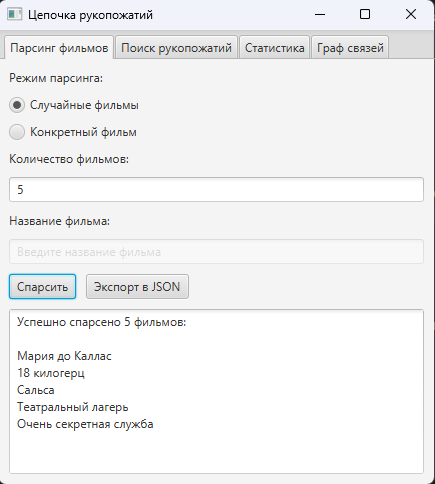
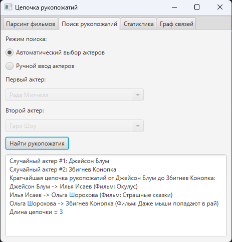
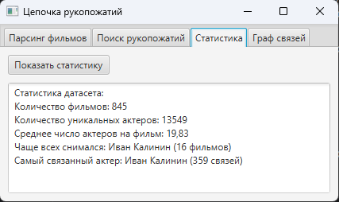
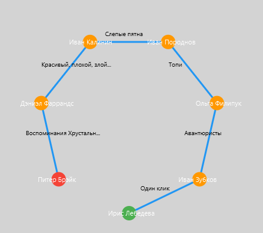

# Проект "Цепочка рукопожатий"

---
Этот проект представляет собой Java-приложение, которое взаимодействует с **Kinopoisk API** для получения информации о фильмах, создания графа связей между актёрами на основе их совместного участия в фильмах и поиска **кратчайшей цепочки «рукопожатий»** между двумя актёрами. Программа позволяет парсить данные, сохранять их в CSV, строить граф и визуализировать найденные цепочки в графическом интерфейсе.


## Основные возможности

| Функция | Описание |
|--------|--------|
| **Парсинг фильмов** | Случайные (1–200) или по названию → сохраняется в `film_dataset.csv` |
| **Граф актёров** | Автоматически строится: актёры — вершины, фильмы — ребра |
| **Поиск цепочки** | BFS → кратчайший путь + **фильмы на каждом шаге** |
| **Визуализация пути** | Граф показывает **только найденную цепочку**, с цветами и подписями |
| **Автодополнение** | `ComboBox` с именами всех актёров из датасета |
| **Экспорт в JSON** | Кнопка → `film_dataset.json` |
| **Статистика** | Фильмы, актёры, среднее, топ по фильмам и связям |
| **Асинхронность** | Параллельные запросы к API |
| **Логирование** | SLF4J + Logback |
| **GUI** | Одно окно, 4 вкладки |


## Требования

---

| Компонент | Версия |
|---------|--------|
| **Java** | JDK 17+ |
| **Maven** | 3.6+ |
| **API-токен** | Kinopoisk DEV [](https://kinopoisk.dev/) |
| **OS** | Windows / macOS / Linux |


## Структура проекта

---
```
handshakes/
├── src/main/java/org/handshakes/
│   ├── Main.java              # GUI (вкладки: Парсинг, Поиск, Статистика, Граф)
│   ├── ApiClient.java         # HTTP-запросы к Kinopoisk API
│   ├── DatasetManager.java    # CSV, JSON, статистика, автодополнение
│   ├── Graph.java             # Граф актёров
│   ├── HandshakeFinder.java   # BFS-поиск цепочек + передача пути в GUI
│   ├── Movie.java             # Модель фильма
├── src/main/resources/
│   ├── application.properties # kinopoisk.api.token=YOUR_TOKEN
│   ├── logback.xml            # Конфиг логирования
├── film_dataset.csv           # Автоматически создаётся
├── film_dataset.json          # Экспорт (по кнопке)
├── pom.xml                    # Maven + JavaFX
└── README.md
```

## Установка и настройка

---
1. **Клонируйте репозиторий** (или создайте проект вручную):
   ```bash
   git clone https://github.com/viooolity/handshakes.git
   cd handshakes
   ```
2. **Настройте pom.xml:** Убедитесь, что файл содержит зависимости и плагин `javafx-maven-plugin`:
   ```xml
   <properties>
        <maven.compiler.source>17</maven.compiler.source>
        <maven.compiler.target>17</maven.compiler.target>
        <project.build.sourceEncoding>UTF-8</project.build.sourceEncoding>
        <project.reporting.outputEncoding>UTF-8</project.reporting.outputEncoding>
    </properties>

    <dependencies>
        <dependency>
            <groupId>org.json</groupId>
            <artifactId>json</artifactId>
            <version>20231013</version>
        </dependency>
        <dependency>
            <groupId>com.google.code.gson</groupId>
            <artifactId>gson</artifactId>
            <version>2.11.0</version>
        </dependency>
        <dependency>
            <groupId>com.opencsv</groupId>
            <artifactId>opencsv</artifactId>
            <version>5.7.1</version>
        </dependency>
        <dependency>
            <groupId>org.slf4j</groupId>
            <artifactId>slf4j-api</artifactId>
            <version>2.0.9</version>
        </dependency>
        <dependency>
            <groupId>ch.qos.logback</groupId>
            <artifactId>logback-classic</artifactId>
            <version>1.4.11</version>
        </dependency>
        <dependency>
            <groupId>org.openjfx</groupId>
            <artifactId>javafx-controls</artifactId>
            <version>17</version>
        </dependency>
        <dependency>
            <groupId>org.openjfx</groupId>
            <artifactId>javafx-fxml</artifactId>
            <version>17</version>
        </dependency>
    </dependencies>

    <build>
        <plugins>
            <plugin>
                <groupId>org.apache.maven.plugins</groupId>
                <artifactId>maven-compiler-plugin</artifactId>
                <version>3.14.0</version>
                <configuration>
                    <source>17</source>
                    <target>17</target>
                </configuration>
            </plugin>
            <plugin>
                <groupId>org.openjfx</groupId>
                <artifactId>javafx-maven-plugin</artifactId>
                <version>0.0.8</version>
                <configuration>
                    <mainClass>org.handshakes.Main</mainClass>
                </configuration>
            </plugin>
        </plugins>
    </build>
   ```
3. **Настройте API-токен:**
- Откройте файл src/main/resources/application.properties.
- Замените YOUR-TOKEN-HERE на ваш токен Kinopoisk DEV:
   ```properties
   kinopoisk.api.token=YOUR-TOKEN-HERE
   ```
4. **Соберите проект:**
   ```bash
   mvn clean install
   ```
   

## Использование

---
1. **Запустите программу:**
    ```bash
    mvn javafx:run
    ```

2. **Интерфейс:**

    Программа предлагает графическое меню:
- **Опция 1:** Парсинг фильмов.
  - Случайные фильмы: Загрузка указанного количества случайных фильмов (1–200).
  - Конкретный фильм: Ввод названия конкретного фильма.
  - Экспорт в JSON: Сохранить датасет в формате JSON.

- **Опция 2**: Поиск цепочки рукопожатий.
  - Автоматический выбор: Случайный выбор двух актеров из датасета.
  - Ручной ввод: Ручной ввод имен двух актеров.
- **Опция 3**: Статистика.
    - Отображает статистику датасета: количество фильмов, уникальных актеров, среднее число актеров на фильм, самый часто встречающийся актер.
- **Опция 4**: Отображение графа.
    - Программа выведет граф найденной цепочки актеров.

3. **Пример работы:**

- **Парсинг 5 случайных фильмов:**
    
    Программа загрузит данные о фильмах и сохранит их в film_dataset.csv.



- **Поиск рукопожатий:**
  
    Программа выберет двух случайных актеров и выведет цепочку:

- **Статистика:**

Программа выведет статистику датасета:
  

- **Отображение графа:**

Программа выведет граф для найденной цепочки актеров:




## Оптимизации

---

- Кэширование: Датасет и граф хранятся в памяти, минимизируя операции ввода-вывода.
- Асинхронность: Параллельные API-запросы с использованием CompletableFuture и пула потоков.
- Логирование: Используется SLF4J с Logback для структурированного вывода логов.
- Конфигурация: API-токен вынесен в application.properties.
- Модульность: Логика разделена на классы (ApiClient, DatasetManager, Graph, HandshakeFinder) для соответствия принципу единственной ответственности.
- Обработка ошибок: Валидация ввода и специфичные исключения (IOException, InterruptedException).
- GUI: JavaFX, одно окно, вкладки


## Логирование 

---
- **Логи выводятся в консоль в формате:**
  ```text
  2025-04-05 12:34:56 INFO  HandshakeFinder - Цепочка найдена: длина 2
    ```

Для настройки вывода логов в файл измените ```src/main/resources/logback.xml```, добавив:

```xml
<configuration>
    <appender name="CONSOLE" class="ch.qos.logback.core.ConsoleAppender">
        <encoder>
            <pattern>%d{yyyy-MM-dd HH:mm:ss} %-5level %logger{36} - %msg%n</pattern>
            <charset>UTF-8</charset>
        </encoder>
    </appender>
    <root level="info">
        <appender-ref ref="CONSOLE"/>
    </root>
</configuration>
```


## Автор

---
Иван Серга
